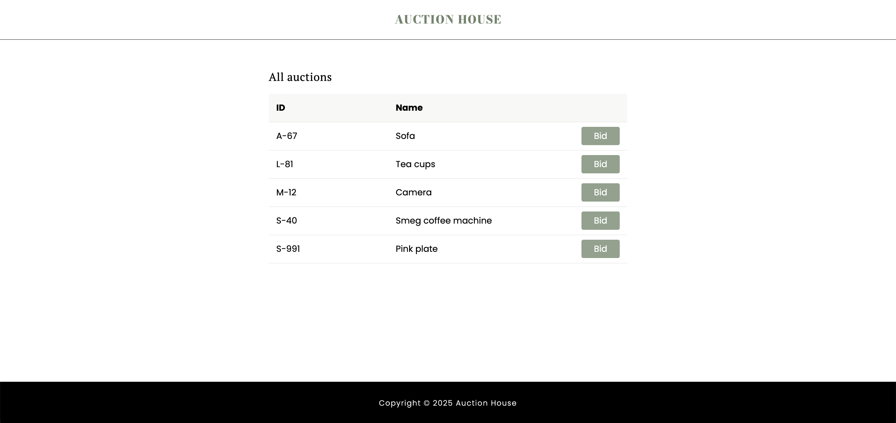
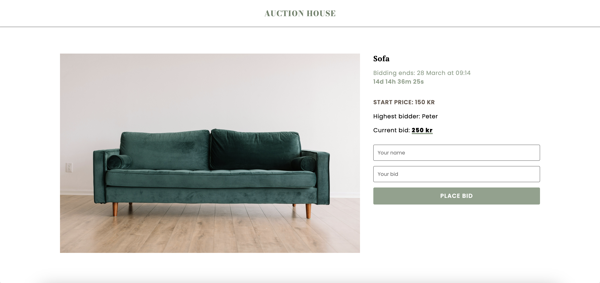
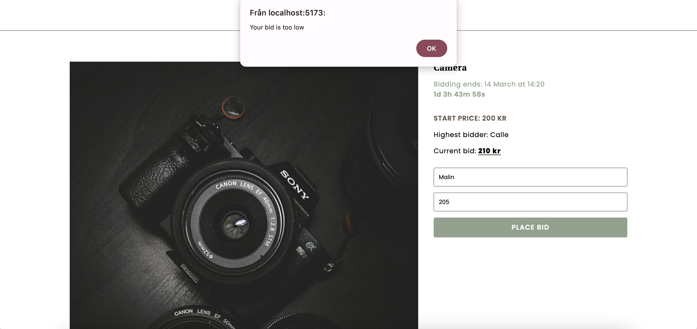
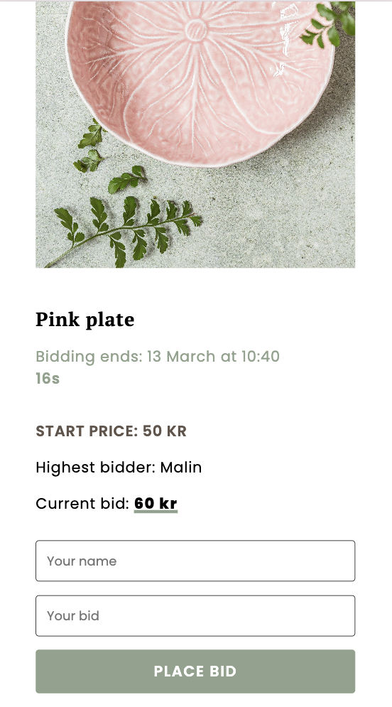

# School assignment
* Created an auction site using Websockets 

## Backend
* smart room management is implemented on both the server and the client.
* endpoint => Returns the current auction.
```
app.get('/api/auctions/:id', (req, res) => {
  res.json(data.auctions.filter((auction) => auction.id === req.params.id)[0]);
});
```
* The server handles placeLatestBid, verifies it, and emits either bidRefused (to the specific client) and/or updatedBid (to all clients).
* Auctions and latest bids are connected to a local database.
```
export async function Init(){
    const conn = await connection;
    const [rows] = await conn.query<databaseauction[]>("SELECT * FROM auction")

    rows.forEach((row: databaseauction) => {
        const auction = new Auction(
          row.id, 
          row.name, 
          new Bidder(row.biddername, row.bidprice), 
          row.img, 
          row.minprice, 
          row.endtime
        )

        auctions.push(auction);
    })
};
```
```
export async function updateBid(id: string, biddername: string, bidprice: number) {
    const conn = await connection; 
    await conn.query("UPDATE auction set biddername=?, bidprice=? where id=?", [biddername,bidprice, id]);
}
```


## Frontend
* index.html => lists all auctions
  

* oneauction.html => contains information about an specific auction and inputs (biddername, price) to place a bid.
* room.ts => fetch the current auction and hooks up with the websocket 
* placeLatestBid 
* bidRefused
* updatedBid 

  
  

* countdown.ts => creates a countdown based on the auction endtime 
* changed some html when an auction is closed 
  #### Mobile view
  <p float="left">
    
    
  </p>
____________

### 1. Clone this repository 
```
git clone https://github.com/malinjansson/Auctionhouse.git
```

### 2. Navigate to the project folder
```
cd Auctionhouse
```

### 3. Install dependencies 
#### Terminal 1
```
cd backend
npm install
```
#### Terminal 2
```
cd frontend
npm install
```

### 4. Setup backend and frontend
#### Backend
```
cd backend
npm run dev
```
Server is running on http://localhost:3000

#### Frontend
```
cd frontend
npm run dev
```
Local: http://localhost:5173/


