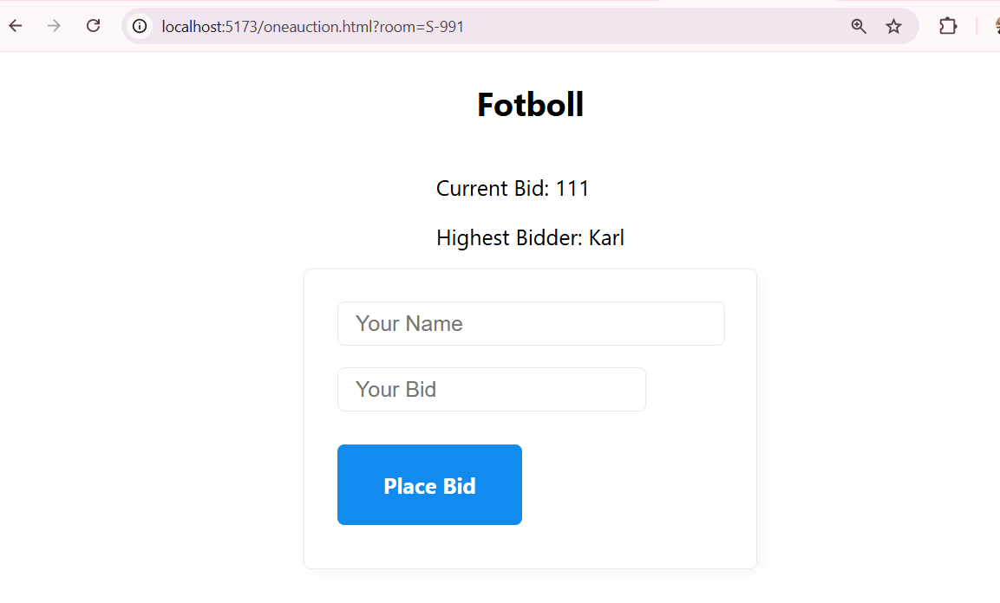

# Assignment
* gör så auktionssajten funkar (med websockets)

## Backend
* smart roomhantering har ni i servern och client (bortkommenterat)
* lägg till en endpoint app.get('/api/auctions/:id', (req, res) =>   som returnerar aktuell auktion
* server hanterar placeBid, verifierar och emittar bidRefused (till den aktuella klienten) och/eller bidUpdated (till alla)
* förslag
```
export class Auction{
    bids:Array<Bid>;
    
    constructor(public id:string, public name:string, public minprice:number){

      this.bids = []  
    }
}
```

## Frontend
* index.html  funkar = listar alla auktioner


* bygg en oneauction.html - ska innehålla information om gjorda bud + formulär för att lägga bud


* room.ts ska hämta aktuell auction via fetch - skriva ut namn etc
* room.ts hookar upp med websocket och ni implemnterar 
* placeBid
* bidRefused
* bidUpdated


